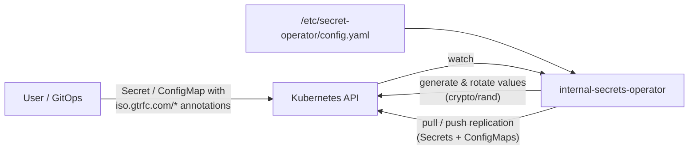

# Internal Secrets Operator

[](https://github.com/guided-traffic/internal-secrets-operator/actions)
[](https://github.com/guided-traffic/internal-secrets-operator)
[](https://goreportcard.com/report/github.com/guided-traffic/internal-secrets-operator)
[](LICENSE)

A Kubernetes operator that generates cryptographically secure random values for
Secrets and replicates Secrets and ConfigMaps across namespaces. Everything is
driven by annotations on plain core resources — no CRDs required.



## ✨ Key Features

- 🔐 **Automatic secret generation** — fills empty Secret fields with random values from `crypto/rand`
- 🔑 **Keypair generation** — RSA, ECDSA, Ed25519 plus post-quantum ML-KEM (FIPS 203), ML-DSA (FIPS 204), SLH-DSA (FIPS 205)
- 🔄 **Automatic rotation** — per-field rotation intervals, optionally restricted to maintenance windows
- 🎯 **Annotation-based** — works on plain `v1/Secret` and `v1/ConfigMap`, no CRDs
- 🤝 **Pull replication with mutual consent** — both source and target must opt in before data crosses namespaces
- 📤 **Push replication** — push a Secret/ConfigMap to a list of namespaces, with finalizer-based cleanup
- 🌐 **Global pull permissions** — operator-level allow rules for sources you cannot annotate
- 🧩 **Feature toggles** — generator, Secret replicator, and ConfigMap replicator can be disabled independently
- 📣 **Kubernetes Events** — every failure (and optionally every rotation) is visible in `kubectl describe`

## 📛 Naming conventions

All annotations share the prefix `iso.gtrfc.com/`.

**Annotations you set (generation, on Secrets):**

| Annotation | Meaning |
|------------|---------|
| `iso.gtrfc.com/autogenerate` | Comma-separated list of data fields to generate |
| `iso.gtrfc.com/type`, `iso.gtrfc.com/type.<field>` | Generation type (global / per field) |
| `iso.gtrfc.com/length`, `iso.gtrfc.com/length.<field>` | Length (global / per field) |
| `iso.gtrfc.com/curve`, `iso.gtrfc.com/curve.<field>` | ECDSA curve (global / per field) |
| `iso.gtrfc.com/param`, `iso.gtrfc.com/param.<field>` | Post-quantum parameter set (global / per field) |
| `iso.gtrfc.com/rotate`, `iso.gtrfc.com/rotate.<field>` | Rotation interval (global / per field) |
| `iso.gtrfc.com/string.uppercase` · `string.lowercase` · `string.numbers` · `string.specialChars` · `string.allowedSpecialChars` | Charset options for `string` fields (Secret-wide, no per-field variant) |

**Annotations you set (replication, on Secrets and ConfigMaps):**

| Annotation | Side | Meaning |
|------------|------|---------|
| `iso.gtrfc.com/replicatable-from-namespaces` | source (pull) | Namespace allowlist (glob) that may pull from this object |
| `iso.gtrfc.com/replicate-from` | target (pull) | `"<namespace>/<name>"` of the source object |
| `iso.gtrfc.com/replicate-to` | source (push) | Comma-separated target namespaces |

**Annotations the operator sets:**

| Annotation | Meaning |
|------------|---------|
| `iso.gtrfc.com/generated-at` | RFC 3339 timestamp of the last generation/rotation (one per Secret, not per field) |
| `iso.gtrfc.com/replicated-from` | `"<namespace>/<name>"` of the source this object was replicated from |
| `iso.gtrfc.com/last-replicated-at` | RFC 3339 timestamp of the last replication |

**Generated Secret data keys:**

| Key | Content |
|-----|---------|
| `<field>` | Generated value; for keypair types: the private key |
| `<field>.pub` | Public key (keypair types only) |

**Other fixed names:**

| Name | Value |
|------|-------|
| Finalizer (push sources) | `iso.gtrfc.com/replicate-to-cleanup` |
| Controller names | `secret-generator`, `secret-replicator`, `configmap-replicator` |
| Event source names | `secret-operator`, `secret-replicator`, `configmap-replicator` |
| Leader election lease ID | `secret-operator.guided-traffic.com` |
| Config file path (in container) | `/etc/secret-operator/config.yaml` |
| Container image (released) | `docker.io/guidedtraffic/internal-secrets-operator` |
| Metrics / health ports | `8080` (`/metrics`) / `8081` (`/healthz`, `/readyz`) |

**Helm resource names** (release name `internal-secrets-operator` collapses the
`<release>-<chart>` pattern to just the chart name):

| Resource | Name |
|----------|------|
| Deployment, ServiceAccount, ClusterRole, ClusterRoleBinding, ServiceMonitor | `<fullname>` |
| ConfigMap (operator config) | `<fullname>-config` |
| Service (metrics) | `<fullname>-metrics` |

## 📚 Documentation

| Document | Content |
|----------|---------|
| [DEVELOPER.md](DEVELOPER.md) | Repo layout, package responsibilities, reconcile flows, extension checklists, CI/release |
| [SECURITY_ARCHITECTURE.md](SECURITY_ARCHITECTURE.md) | Trust boundaries, privilege footprint, isolation model, residual risks |
| [Full reference](#-full-reference) | Every annotation, config option, and Helm value |
| [Helm chart README](deploy/helm/internal-secrets-operator/README.md) | Chart-specific values documentation |
| [Sample manifests](config/samples/) | Generation, post-quantum, and replication examples |
| [controller-runtime](https://github.com/kubernetes-sigs/controller-runtime) | Upstream controller framework |

## 🚀 TL;DR fast start

Install via Helm (chart is published to GitHub Pages on every release):

```bash
helm repo add internal-secrets-operator https://guided-traffic.github.io/internal-secrets-operator
helm repo update
helm install internal-secrets-operator internal-secrets-operator/internal-secrets-operator \
  --namespace internal-secrets-operator-system --create-namespace
```

Generate a password:

```yaml
apiVersion: v1
kind: Secret
metadata:
  name: my-app
  annotations:
    iso.gtrfc.com/autogenerate: password
```

Generate an RSA keypair (`length` is the key size in bits and required for `rsa`):

```yaml
apiVersion: v1
kind: Secret
metadata:
  name: my-tls
  annotations:
    iso.gtrfc.com/autogenerate: tls-key
    iso.gtrfc.com/type: rsa
    iso.gtrfc.com/length: "4096"
```

Replicate a Secret into another namespace (both sides must consent):

```yaml
# Source
apiVersion: v1
kind: Secret
metadata:
  name: db-credentials
  namespace: production
  annotations:
    iso.gtrfc.com/replicatable-from-namespaces: "staging"
data:
  password: cHJvZHBhc3M=
---
# Target
apiVersion: v1
kind: Secret
metadata:
  name: db-credentials
  namespace: staging
  annotations:
    iso.gtrfc.com/replicate-from: "production/db-credentials"
```

Verify:

```bash
kubectl get secret my-app -o jsonpath='{.data.password}' | base64 -d
kubectl describe secret my-app     # events show generation/rotation/replication errors
```

<details>
<summary>Upgrade / uninstall / Kustomize install</summary>

```bash
# Upgrade
helm repo update
helm upgrade internal-secrets-operator internal-secrets-operator/internal-secrets-operator \
  --namespace internal-secrets-operator-system

# Uninstall
helm uninstall internal-secrets-operator --namespace internal-secrets-operator-system
```

Kustomize (development/testing only — runs with built-in defaults, no config
file, leader election disabled, image from `ghcr.io`):

```bash
kubectl apply -k https://github.com/guided-traffic/internal-secrets-operator/config/default
```

</details>

## 📖 Full reference

### Generation annotations

Applied to Secrets. Priority: `<key>.<field>` annotation > `<key>` annotation >
config file > built-in default.

| Annotation | Default | Description |
|------------|---------|-------------|
| `autogenerate` | *(required)* | Comma-separated field names. Empty entries are dropped; an empty list means the Secret is ignored. |
| `type` / `type.<field>` | `string` # default | One of `string`, `bytes`, `rsa`, `ecdsa`, `ed25519`, `mlkem`, `mldsa`, `slhdsa` |
| `length` / `length.<field>` | `32` # default | Characters (`string`), bytes (`bytes`), or key size in bits (`rsa`). Ignored by all other types. |
| `curve` / `curve.<field>` | `P-256` # default | ECDSA curve: `P-256`, `P-384`, `P-521` |
| `param` / `param.<field>` | type-dependent | Post-quantum parameter set, see [generation types](#generation-types) |
| `rotate` / `rotate.<field>` | *(none — no rotation)* | Rotation interval, e.g. `24h`, `7d`. See [rotation](#automatic-rotation). |
| `string.uppercase` | `true` # default | Include `A-Z` in generated strings |
| `string.lowercase` | `true` # default | Include `a-z` |
| `string.numbers` | `true` # default | Include `0-9` |
| `string.specialChars` | `false` # default | Include special characters |
| `string.allowedSpecialChars` | `!@#$%^&*()_+-=[]{}\|;:,.<>?` # default | Which special characters to use |

Notes (behavior verified against
[secret_controller.go](internal/controller/secret_controller.go)):

- Existing field values are **never overwritten** by generation — only empty
  fields are filled. Rotation is the exception and does overwrite.
- The `string.*` charset options apply to **all** string fields of the Secret;
  there is no per-field variant. At least one charset class must be enabled,
  and `allowedSpecialChars` must be non-empty when `specialChars` is `true` —
  otherwise the operator emits a Warning Event and changes nothing.
- A generation error for one field aborts the whole reconcile: **no field** of
  that Secret is written until the error is fixed.
- For `rsa`, `length` must be ≥ `1024` ([generator.go](pkg/generator/generator.go)).
  There is no RSA-specific default — leaving `length` unset means the global
  default `32` is used as bit size and generation fails with a Warning Event.
  Always set `length` explicitly for RSA (`2048` or `4096`).
- Invalid `length.<field>` values (non-numeric, ≤ 0) are silently ignored and
  the fallback level applies.

### Generation types

| Type | Output | `length` meaning | Use-case |
|------|--------|------------------|----------|
| `string` | Random string from the configured charset | Number of characters | Passwords, tokens |
| `bytes` | Raw random bytes (Base64 in the Secret, like all Secret data) | Number of bytes | Encryption keys |
| `rsa` | RSA keypair, PEM | Key size in bits (≥ 1024, use `2048`/`4096`) | TLS, signing |
| `ecdsa` | ECDSA keypair, PEM | *(ignored — use `curve`)* | TLS, JWT (ES256/384/512) |
| `ed25519` | Ed25519 keypair, PEM | *(ignored — fixed 256-bit)* | SSH, modern signing |
| `mlkem` | ML-KEM keypair (FIPS 203), raw bytes | *(ignored — use `param`)* | Post-quantum key encapsulation |
| `mldsa` | ML-DSA keypair (FIPS 204), raw bytes | *(ignored — use `param`)* | Post-quantum signatures |
| `slhdsa` | SLH-DSA keypair (FIPS 205, SHA2 variants), raw bytes | *(ignored — use `param`)* | Post-quantum signatures (conservative, hash-based) |

Keypair types write two data entries: `<field>` (private key) and
`<field>.pub` (public key).

**PEM encodings** (verified against [generator.go](pkg/generator/generator.go) —
the three classical types use different standard encodings):

| Type | Private key | Public key |
|------|-------------|------------|
| `rsa` | PKCS#1, `BEGIN RSA PRIVATE KEY` | PKCS#1, `BEGIN RSA PUBLIC KEY` |
| `ecdsa` | SEC 1 / RFC 5915, `BEGIN EC PRIVATE KEY` | PKIX/SPKI, `BEGIN PUBLIC KEY` |
| `ed25519` | PKCS#8, `BEGIN PRIVATE KEY` | PKIX/SPKI, `BEGIN PUBLIC KEY` |

**Post-quantum parameter sets** (`param` / `param.<field>`; keys are raw
bytes, not PEM):

| Type | Parameters | Default | Library |
|------|-----------|---------|---------|
| `mlkem` | `768` (NIST level 3), `1024` (level 5) | `768` # default | Go stdlib `crypto/mlkem` |
| `mldsa` | `65` (level 3), `87` (level 5) | `65` # default | `github.com/cloudflare/circl` |
| `slhdsa` | `128s`, `128f`, `192s`, `192f`, `256s`, `256f` (`s` = small/slow, `f` = fast/large) | `128s` # default | `github.com/cloudflare/circl` (SHA2 variants) |

<details>
<summary>Examples: multiple fields, per-field types, keypairs, post-quantum</summary>

```yaml
# Different types per field
apiVersion: v1
kind: Secret
metadata:
  name: mixed-secret
  annotations:
    iso.gtrfc.com/autogenerate: password,encryption-key
    iso.gtrfc.com/type: string            # default for all fields
    iso.gtrfc.com/length: "24"
    iso.gtrfc.com/type.encryption-key: bytes
    iso.gtrfc.com/length.encryption-key: "32"
```

```yaml
# Numbers-only PIN (charset options apply to ALL string fields)
apiVersion: v1
kind: Secret
metadata:
  name: pin-secret
  annotations:
    iso.gtrfc.com/autogenerate: pin
    iso.gtrfc.com/length: "6"
    iso.gtrfc.com/string.uppercase: "false"
    iso.gtrfc.com/string.lowercase: "false"
    iso.gtrfc.com/string.numbers: "true"
```

```yaml
# Password with a restricted special character set
apiVersion: v1
kind: Secret
metadata:
  name: password-special-chars
  annotations:
    iso.gtrfc.com/autogenerate: password
    iso.gtrfc.com/length: "24"
    iso.gtrfc.com/string.specialChars: "true"
    iso.gtrfc.com/string.allowedSpecialChars: "!@#$%^&*"
```

```yaml
# ECDSA keypair (data keys: signing-key, signing-key.pub)
apiVersion: v1
kind: Secret
metadata:
  name: signing-keypair
  annotations:
    iso.gtrfc.com/autogenerate: signing-key
    iso.gtrfc.com/type: ecdsa
    iso.gtrfc.com/curve: "P-384"
```

```yaml
# One Secret with classical and post-quantum keys
apiVersion: v1
kind: Secret
metadata:
  name: mixed-credentials
  annotations:
    iso.gtrfc.com/autogenerate: password,tls-key,ssh-key,kem-key,dsa-key,hash-sig-key
    iso.gtrfc.com/type: string
    iso.gtrfc.com/type.tls-key: rsa
    iso.gtrfc.com/length.tls-key: "4096"
    iso.gtrfc.com/type.ssh-key: ed25519
    iso.gtrfc.com/type.kem-key: mlkem
    iso.gtrfc.com/param.kem-key: "1024"
    iso.gtrfc.com/type.dsa-key: mldsa
    iso.gtrfc.com/param.dsa-key: "87"
    iso.gtrfc.com/type.hash-sig-key: slhdsa
    iso.gtrfc.com/param.hash-sig-key: "192f"
```

</details>

### Regenerating values

Generation never overwrites existing values. To force regeneration, remove the
field (or the whole Secret):

```bash
kubectl patch secret my-secret --type=json -p='[{"op": "remove", "path": "/data/password"}]'
```

### Automatic rotation

Rotation **overwrites** existing values on a schedule. Enable per Secret with
`rotate` (all fields) or `rotate.<field>` (one field; overrides `rotate`).
Fields without any rotate annotation are generated once and never rotated.

Duration format: Go durations (`30s`, `15m`, `24h`, `1h30m`) plus a `d` suffix
for days (`7d` = 168h).

Behavior (verified against [secret_controller.go](internal/controller/secret_controller.go)):

- The operator stores **one** `generated-at` timestamp per Secret. Writing any
  field (initial generation or rotation) resets the rotation clock for **all**
  fields of that Secret.
- Intervals below `rotation.minInterval` (default `5m` # default): the field is
  **not rotated** — a Warning Event (`RotationFailed`) is emitted each
  reconcile, and initial generation of an empty field still happens. The
  interval is *not* clamped to the minimum.
- Malformed `rotate` values are **silently ignored** (fallback to the
  Secret-wide `rotate`, then to "no rotation") — check your durations, there
  is no error event for typos.
- The operator requeues itself for the earliest due rotation; no external
  scheduler is involved.
- Consumers must reload rotated credentials — pair rotation with a tool like
  [Reloader](https://github.com/stakater/Reloader) or watch the Secret.

When `rotation.createEvents` is enabled, each rotation emits a Normal Event
(`RotationSucceeded`); Warning Events are always emitted.

<details>
<summary>Rotation examples</summary>

```yaml
# Rotate everything daily, password weekly, api-key never
apiVersion: v1
kind: Secret
metadata:
  name: rotating-secret
  annotations:
    iso.gtrfc.com/autogenerate: password,api-key,encryption-key
    iso.gtrfc.com/rotate: "24h"
    iso.gtrfc.com/rotate.password: "7d"
    # api-key and encryption-key inherit 24h from `rotate`
```

```yaml
# Only password rotates; api-key is generated once
apiVersion: v1
kind: Secret
metadata:
  name: selective-rotation
  annotations:
    iso.gtrfc.com/autogenerate: password,api-key
    iso.gtrfc.com/rotate.password: "7d"
```

</details>

### Maintenance windows

Restrict **rotation** (not initial generation) to configured time windows.
Configured in the operator config, not per Secret:

```yaml
config:
  rotation:
    maintenanceWindows:
      enabled: false            # default
      windows:                  # example
        - name: "weekend-night"
          days: ["saturday", "sunday"]
          startTime: "03:00"
          endTime: "05:00"
          timezone: "Europe/Berlin"
```

| Field | Rules |
|-------|-------|
| `name` | Optional, used in events/logs |
| `days` | ≥ 1 of `sunday` … `saturday` (case-insensitive) |
| `startTime` / `endTime` | `HH:MM`, 24h; `endTime` must be after `startTime` (no overnight windows) |
| `timezone` | Any IANA timezone, required |

Validation runs at startup; invalid windows prevent the operator from starting.
When rotation is due outside all windows it is deferred: a Normal Event
(`RotationDeferred`) records the next window start and the controller requeues
itself for that time.

### Replication

Replication works identically for Secrets and ConfigMaps (ConfigMaps also
replicate `binaryData`). Three annotations drive it:

| Annotation | Side | Value |
|------------|------|-------|
| `replicatable-from-namespaces` | pull source | Namespace allowlist: exact names, globs (`env-*`, `ns-[0-9]`), or `*` for all |
| `replicate-from` | pull target | `"<namespace>/<name>"` — exactly one source per target |
| `replicate-to` | push source | Comma-separated namespace list |

**Pull-based replication — mutual consent.** Data flows only when *both* sides
opt in: the source allowlists the target namespace **or** a
[global pull permission](#global-pull-based-permissions) matches, *and* the
target names the source in `replicate-from`. The annotation allowlist is
checked first, then global permissions
([global_permissions.go](pkg/replicator/global_permissions.go)).

Glob syntax for the allowlist: `*`, `?`, `[abc]`, `[a-z]`, `[0-9]`.

> **Security note:** `replicatable-from-namespaces: "*"` lets **any**
> namespace pull the object. Anyone with permission to create a Secret with
> annotations in an allowlisted namespace receives the data — the consent
> model delegates access control to namespace-level RBAC. See
> [SECURITY_ARCHITECTURE.md](SECURITY_ARCHITECTURE.md).

Pull behavior:

- Targets sync automatically when the source changes (watch-driven).
- Replication **merges** data: source keys overwrite target keys, but keys
  deleted from the source remain in the target until the target is recreated.
  Do not rely on key removal propagating.
- Labels are copied only when a push target is first created; label changes
  never propagate afterwards. Source annotations are never copied.
- If the source is deleted, the target keeps its last data (snapshot) and a
  Warning Event (`SourceDeleted`) is emitted.
- `autogenerate` + `replicate-from` on the same Secret is a conflict: the
  replicator refuses (Warning `ConflictingFeatures`) while the generator still
  runs — effectively generation wins and pull stays disabled. Fix by removing
  one of the two annotations.

**Push-based replication.** A source with `replicate-to` creates/updates a
copy (same name) in each listed namespace:

- The operator adds the finalizer `iso.gtrfc.com/replicate-to-cleanup` to the
  **source**; deleting the source deletes all pushed copies, then releases the
  finalizer.
- Pushed copies carry `replicated-from: "<ns>/<name>"`. Only objects whose
  annotation matches the source are ever updated or cleaned up.
- If a target of the same name exists without that annotation, it is
  **skipped** — Warning `PushFailed` on the source, the existing object is
  never adopted or overwritten.
- Per-namespace failures don't abort the loop; failed targets are retried on
  the next watch event.
- `autogenerate` + `replicate-to` is valid: generate once, push everywhere.

> **Warning:** cleanup deletes every object in the cluster whose
> `replicated-from` matches the source — including **pull** targets of that
> same source, since pull writes the same annotation. If a source is both
> pulled from and pushed elsewhere, deleting it also deletes the pull targets'
> objects.

<details>
<summary>Replication examples (pull, push, ConfigMap, generate+push)</summary>

```yaml
# Pull with glob allowlist
apiVersion: v1
kind: Secret
metadata:
  name: shared-ca
  namespace: infra
  annotations:
    iso.gtrfc.com/replicatable-from-namespaces: "team-*,staging"
```

```yaml
# Push a ConfigMap to two namespaces
apiVersion: v1
kind: ConfigMap
metadata:
  name: shared-config
  namespace: production
  annotations:
    iso.gtrfc.com/replicate-to: "staging,development"
data:
  settings.json: '{"env": "prod"}'
```

```yaml
# Generate in one namespace, push to app namespaces
apiVersion: v1
kind: Secret
metadata:
  name: encryption-keys
  namespace: security
  annotations:
    iso.gtrfc.com/autogenerate: "master-key,data-key"
    iso.gtrfc.com/type: "bytes"
    iso.gtrfc.com/length: "32"
    iso.gtrfc.com/replicate-to: "app-1,app-2,app-3"
```

More: [config/samples/](config/samples/)

</details>

### Global pull-based permissions

For sources you cannot annotate (managed by another controller/team),
pull consent can be granted in the operator configuration instead:

```yaml
globalPullBasedPermissions: []      # default
# - fromNamespace: "namespace-a"           # exact names, comma-separated
#   toNamespace: "namespace-b,namespace-c" # exact names, comma-separated
#   validationPattern: "shoot-*"           # glob on the SOURCE OBJECT NAME
#   allowConfigMap: true                   # default false
#   allowSecret: false                     # default false
```

- Replaces only the **source-side** consent; targets still need
  `replicate-from`. Additive to annotations (annotation OR global permission).
- Namespaces are matched **exactly** (validated as DNS-1123 labels at startup —
  no patterns, `*` is rejected); the object name is matched via glob.
- Startup validation: non-empty namespace lists, non-empty valid glob, at
  least one of `allowSecret`/`allowConfigMap` — violations prevent startup.

> **Security note:** a global permission bypasses the source owner's consent.
> It is set by whoever controls the operator config (cluster operator). Scope
> it narrowly: exact namespaces and a restrictive `validationPattern`.

### Configuration file

Read once at startup from `/etc/secret-operator/config.yaml` (`--config` flag;
built-in defaults apply when the file is missing). The Helm chart renders
`.Values.config` 1:1 into this file and rolls the Deployment on changes.

```yaml
defaults:
  type: string                    # default; allowed here: string, bytes, rsa, ecdsa, ed25519
  length: 32                      # default
  string:
    uppercase: true               # default
    lowercase: true               # default
    numbers: true                 # default
    specialChars: false           # default
    allowedSpecialChars: "!@#$%^&*()_+-=[]{}|;:,.<>?"  # default

rotation:
  minInterval: 5m                 # default
  createEvents: false             # default
  maintenanceWindows:
    enabled: false                # default
    windows: []                   # default

features:
  secretGenerator: true           # default
  secretReplicator: true          # default
  configMapReplicator: true       # default

globalPullBasedPermissions: []    # default
```

| Option | Default | Notes |
|--------|---------|-------|
| `defaults.type` | `string` | **Config-file validation accepts only `string`, `bytes`, `rsa`, `ecdsa`, `ed25519`** ([config.go](pkg/config/config.go)). Post-quantum types (`mlkem`, `mldsa`, `slhdsa`) can only be selected via annotations. |
| `defaults.length` | `32` | Must be > 0 |
| `defaults.string.*` | see above | At least one charset class must be `true`; `allowedSpecialChars` non-empty when `specialChars` is `true` |
| `rotation.minInterval` | `5m` | Guards against tight rotation loops (API load). Shorter `rotate` annotations are rejected per field with a Warning Event. |
| `rotation.createEvents` | `false` | Normal Events on successful rotation |
| `rotation.maintenanceWindows` | disabled | See [maintenance windows](#maintenance-windows) |
| `features.*` | all `true` | Toggles register/skip whole controllers at startup — a disabled feature establishes no watches |
| `globalPullBasedPermissions` | `[]` | See [global pull-based permissions](#global-pull-based-permissions) |

All validation errors fail startup (CrashLoop with the error in the log) —
misconfiguration is never silently ignored.

### Helm chart values

Complete `values.yaml` reference
([values.yaml](deploy/helm/internal-secrets-operator/values.yaml)):

| Value | Default |
|-------|---------|
| `replicaCount` | `1` |
| `image.repository` | `docker.io/guidedtraffic/internal-secrets-operator` |
| `image.pullPolicy` | `IfNotPresent` |
| `image.tag` | `""` (chart `appVersion`) |
| `imagePullSecrets` / `nameOverride` / `fullnameOverride` | `[]` / `""` / `""` |
| `controller.leaderElection` | `true` |
| `controller.logLevel` | `info` |
| `config.*` | Operator config, rendered 1:1 — see [configuration file](#configuration-file) |
| `serviceAccount.create` / `automount` / `annotations` / `name` | `true` / `true` / `{}` / `""` |
| `rbac.create` | `true` (ClusterRole + leader-election lease permissions) |
| `rbac.clusterRoleBinding.enabled` | `true` — set `false` to bind per namespace, see [RBAC](#rbac-and-namespace-access) |
| `podAnnotations` / `podLabels` | `{}` / `{}` |
| `podSecurityContext` | `runAsNonRoot: true`, seccomp `RuntimeDefault` |
| `securityContext` | no privilege escalation, drop `ALL` capabilities, read-only rootfs, UID `65532` |
| `service.type` / `service.port` | `ClusterIP` / `8080` (metrics) |
| `healthProbe.port` | `8081` |
| `resources` | requests `10m`/`64Mi`, limits `500m`/`128Mi` |
| `livenessProbe` / `readinessProbe` | `GET /healthz` / `GET /readyz` on port `health` |
| `autoscaling.enabled` | `false` — **note: the chart ships no HPA template; enabling this only removes `replicas` from the Deployment** |
| `volumes` / `volumeMounts` / `nodeSelector` / `tolerations` / `affinity` | `[]` / `[]` / `{}` / `[]` / `{}` |
| `serviceMonitor.enabled` | `false` (requires Prometheus Operator CRDs) |
| `serviceMonitor.interval` / `scrapeTimeout` / `labels` | `30s` / `10s` / `{}` |

### RBAC and namespace access

The operator's ClusterRole
([rbac.yaml](deploy/helm/internal-secrets-operator/templates/rbac.yaml)):

| apiGroups | resources | verbs | Why |
|-----------|-----------|-------|-----|
| `""` | `secrets` | get, list, watch, update, patch, create, delete | generation (update/patch), push replication (create), cleanup (delete) |
| `""` | `configmaps` | get, list, watch, update, patch, create, delete | ConfigMap replication |
| `""` | `events` | create, patch | leader election events |
| `events.k8s.io` | `events` | create, patch | controller-runtime `Eventf` (Kubernetes ≥ 1.19) |
| `coordination.k8s.io` | `leases` | get, list, watch, create, update, patch, delete | leader election |

**Two access modes — the security difference matters:**

1. **Cluster-wide (default):** `rbac.clusterRoleBinding.enabled: true`. The
   operator can read and write Secrets in **every** namespace.
2. **Restricted:** `rbac.clusterRoleBinding.enabled: false`, then create
   RoleBindings referencing the ClusterRole in each namespace the operator
   should manage. The operator only ever touches namespaces where a binding
   exists.

```bash
# Restricted mode: grant access per namespace
for ns in production staging development; do
  kubectl create rolebinding internal-secrets-operator \
    --clusterrole=internal-secrets-operator \
    --serviceaccount=internal-secrets-operator-system:internal-secrets-operator \
    --namespace=$ns
done
```

> **Note (restricted mode + leader election):** lease permissions are part of
> the same ClusterRole. With the ClusterRoleBinding disabled you must also
> create a RoleBinding in the **operator's own namespace**, otherwise leader
> election (default on) cannot acquire its lease and the operator will not
> start working.

> **Note:** watches are cluster-scoped either way; in restricted mode the
> operator still attempts to list cluster-wide and needs at least one binding
> to function. Replication across namespaces requires bindings in **both**
> source and target namespaces.

### Events reference

All conditions are surfaced as Kubernetes Events on the affected object
(`kubectl describe secret/configmap <name>`):

| Reason | Type | On | Trigger |
|--------|------|----|---------|
| `GenerationSucceeded` | Normal | Secret | Fields generated (always emitted) |
| `GenerationFailed` | Warning | Secret | Generation error (e.g. invalid charset, RSA size too small) — Secret is not modified |
| `RotationSucceeded` | Normal | Secret | Rotation done — only when `rotation.createEvents: true` |
| `RotationFailed` | Warning | Secret | `rotate` interval below `rotation.minInterval` — field not rotated |
| `RotationDeferred` | Normal | Secret | Rotation due outside maintenance windows — deferred to next window |
| `ConflictingFeatures` | Warning | Secret | `autogenerate` + `replicate-from` on the same Secret |
| `ReplicationFailed` | Warning | target | Invalid `replicate-from` reference, source missing, consent denied, or update failure |
| `SourceDeleted` | Warning | target | Pull source is being deleted; target keeps last data |
| `ReplicationSucceeded` | Normal | target | Pull replication done |
| `PushFailed` | Warning | source | Target namespace inaccessible, unmanaged same-name object in target, or create/update failure |

### Observability

- Metrics: controller-runtime Prometheus metrics on `:8080` (Helm Service
  `<fullname>-metrics`; optional ServiceMonitor via `serviceMonitor.enabled`).
  The endpoint is plain HTTP without authentication — restrict access at the
  network level if needed.
- Health: `/healthz` (liveness) and `/readyz` (readiness) on `:8081`.
- Logging: zap via controller-runtime; level set by `controller.logLevel`
  (`--zap-log-level`). Secret values are never logged.

## 🛠 Development

```bash
make build              # compile to bin/manager
make test               # unit + envtest tests with coverage
make lint               # golangci-lint v2 + go vet
make e2e-local          # full E2E: Kind cluster + Helm install + tests
make run                # run the operator against the current kubeconfig
```

See [DEVELOPER.md](DEVELOPER.md) for repo layout, reconcile flow internals,
extension checklists, and the CI/release pipeline. Commits follow
[Conventional Commits](https://www.conventionalcommits.org/) — releases are
fully automated via semantic-release.

## License

Apache License 2.0 — see [LICENSE](LICENSE).

## Acknowledgments

- Inspired by [kubernetes-secret-generator](https://github.com/mittwald/kubernetes-secret-generator) by Mittwald
- Built with [controller-runtime](https://github.com/kubernetes-sigs/controller-runtime)
